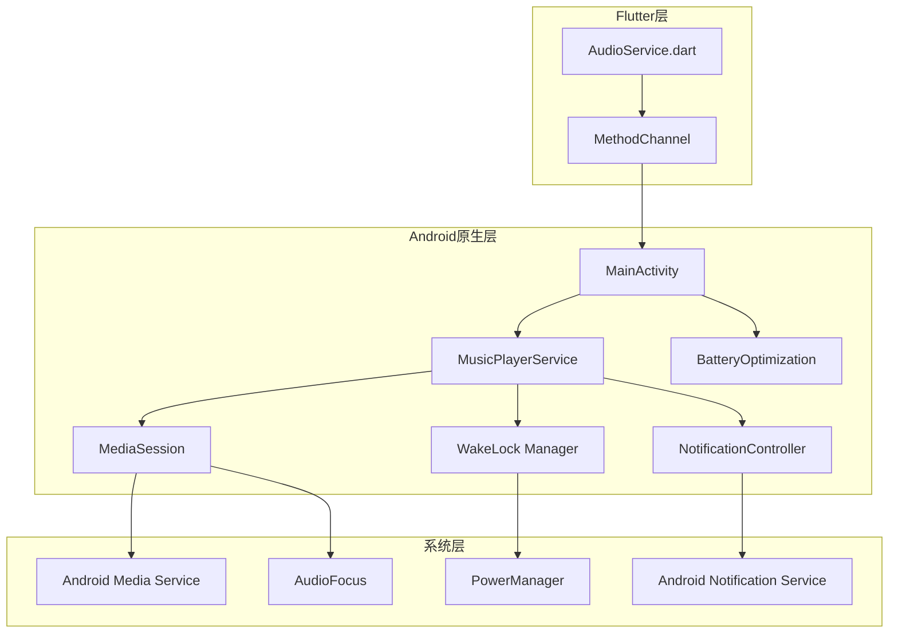

# 设计文档：Android 后台播放稳定性

## 概述

本设计文档描述了解决 Android 音乐应用后台播放被系统杀死问题的技术方案。核心策略是通过增强现有的 `MusicPlayerService` 来实现一个完整的媒体播放前台服务，包括 MediaSession 集成、WakeLock 管理、电池优化豁免请求以及健壮的服务生命周期管理。

## 架构



## 组件和接口

### 1. MusicPlayerService（增强版）

增强现有的 `MusicPlayerService`，使其成为一个完整的媒体播放服务。

```kotlin
class MusicPlayerService : Service() {
    // 常量
    companion object {
        const val NOTIFICATION_ID = 1
        const val CHANNEL_ID = "potunes_music_channel"
        const val ACTION_PLAY = "pink.poche.potunes.ACTION_PLAY"
        const val ACTION_PAUSE = "pink.poche.potunes.ACTION_PAUSE"
        const val ACTION_NEXT = "pink.poche.potunes.ACTION_NEXT"
        const val ACTION_PREVIOUS = "pink.poche.potunes.ACTION_PREVIOUS"
        const val ACTION_STOP = "pink.poche.potunes.ACTION_STOP"
    }
    
    // 核心组件
    private var mediaSession: MediaSessionCompat? = null
    private var wakeLock: PowerManager.WakeLock? = null
    private var audioFocusRequest: AudioFocusRequest? = null
    
    // 当前播放状态
    private var currentTrack: TrackInfo? = null
    private var isPlaying: Boolean = false
    
    // 生命周期方法
    override fun onCreate()
    override fun onStartCommand(intent: Intent?, flags: Int, startId: Int): Int
    override fun onDestroy()
    override fun onBind(intent: Intent?): IBinder?
    
    // 核心功能
    fun updatePlaybackState(track: TrackInfo, playing: Boolean, position: Long)
    fun updateNotification()
    private fun createMediaSession()
    private fun acquireWakeLock()
    private fun releaseWakeLock()
    private fun requestAudioFocus(): Boolean
    private fun abandonAudioFocus()
}
```

### 2. NotificationController

负责创建和更新媒体通知。

```kotlin
class NotificationController(private val context: Context) {
    fun createNotificationChannel()
    fun buildNotification(
        track: TrackInfo,
        isPlaying: Boolean,
        mediaSession: MediaSessionCompat
    ): Notification
    fun updateNotification(notification: Notification)
}
```

### 3. WakeLockManager

管理 WakeLock 的获取和释放。

```kotlin
class WakeLockManager(private val context: Context) {
    private var wakeLock: PowerManager.WakeLock? = null
    
    fun acquire()
    fun release()
    fun isHeld(): Boolean
}
```

### 4. BatteryOptimizationHelper

处理电池优化豁免请求。

```kotlin
object BatteryOptimizationHelper {
    fun isIgnoringBatteryOptimizations(context: Context): Boolean
    fun requestIgnoreBatteryOptimizations(context: Context)
}
```

### 5. Flutter 端接口更新

更新 `AudioService.dart` 中的 MethodChannel 调用。

```dart
class AudioService extends GetxService {
    // 新增方法
    Future<void> _startForegroundService() async
    Future<void> _stopForegroundService() async
    Future<void> _updateNowPlaying() async
    Future<void> requestBatteryOptimization() async
    Future<bool> checkBatteryOptimization() async
}
```

## 数据模型

### TrackInfo

```kotlin
data class TrackInfo(
    val id: String,
    val title: String,
    val artist: String,
    val album: String,
    val coverUrl: String,
    val duration: Long,
    val position: Long = 0
)
```

### PlaybackState

```kotlin
enum class PlaybackState {
    PLAYING,
    PAUSED,
    STOPPED,
    BUFFERING
}
```

## 正确性属性

*正确性属性是一种特征或行为，应该在系统的所有有效执行中保持为真——本质上是关于系统应该做什么的正式声明。属性作为人类可读规范和机器可验证正确性保证之间的桥梁。*

### Property 1: 服务状态与播放状态同步

*对于任何* 播放状态变化（开始/停止），前台服务的运行状态应该与播放状态保持同步。当播放开始时服务应该启动，当播放停止时服务应该停止。

**验证: 需求 1.1, 1.3**

### Property 2: WakeLock 与播放状态同步

*对于任何* 播放状态变化，WakeLock 的持有状态应该与播放状态保持同步。播放时持有 WakeLock，停止时释放 WakeLock。

**验证: 需求 2.1, 2.2**

### Property 3: WakeLock 获取幂等性

*对于任何* 连续多次的 WakeLock 获取请求，系统应该只持有一个 WakeLock，不会创建重复的唤醒锁。

**验证: 需求 2.4**

### Property 4: 通知内容与曲目信息一致

*对于任何* 曲目信息更新，通知中显示的标题、艺术家和封面应该与当前播放的曲目信息完全一致。

**验证: 需求 1.5, 4.5**

### Property 5: 通知包含完整播放控制

*对于任何* 显示的媒体通知，应该包含播放/暂停、上一首、下一首的控制按钮。

**验证: 需求 4.3**

### Property 6: 服务重启时状态完整恢复

*对于任何* 服务重启场景，之前保存的播放状态（曲目、位置、播放列表）应该能够完整恢复。

**验证: 需求 5.2, 5.3**

### Property 7: MediaSession 正确响应系统控制

*对于任何* 系统媒体控制事件（播放、暂停、上一首、下一首），MediaSession 应该正确执行相应的播放操作。

**验证: 需求 6.2, 6.3**

### Property 8: MediaSession 元数据与曲目同步

*对于任何* 曲目变化，MediaSession 的元数据应该与当前播放曲目保持同步。

**验证: 需求 6.4**

### Property 9: 音频焦点变化时播放状态正确响应

*对于任何* 音频焦点变化事件，播放状态应该正确响应：焦点授予时播放，暂时丢失时暂停，永久丢失时停止，恢复时继续播放。

**验证: 需求 7.2, 7.3, 7.4, 7.5**

### Property 10: 优雅降级保持基本功能

*对于任何* 可选功能不可用的情况（如电池优化豁免被拒绝），系统应该继续提供基本的播放功能而不崩溃。

**验证: 需求 9.1, 9.2, 9.3**

## 错误处理

### 服务启动失败

```kotlin
try {
    startForeground(NOTIFICATION_ID, notification)
} catch (e: Exception) {
    Log.e(TAG, "Failed to start foreground service", e)
    // 尝试以普通服务方式运行
    stopForeground(true)
}
```

### WakeLock 获取失败

```kotlin
try {
    wakeLock?.acquire(3 * 60 * 60 * 1000L) // 3小时超时
} catch (e: Exception) {
    Log.w(TAG, "Failed to acquire wake lock", e)
    // 继续播放，但可能在后台被杀死
}
```

### MediaSession 创建失败

```kotlin
try {
    mediaSession = MediaSessionCompat(this, "PotunesToHole")
    // 配置 MediaSession
} catch (e: Exception) {
    Log.e(TAG, "Failed to create MediaSession", e)
    // 继续运行，但系统控制可能不可用
}
```

### 音频焦点请求失败

```kotlin
val result = audioManager.requestAudioFocus(audioFocusRequest)
if (result != AudioManager.AUDIOFOCUS_REQUEST_GRANTED) {
    Log.w(TAG, "Audio focus request denied")
    // 仍然尝试播放，但可能与其他应用冲突
}
```

## 测试策略

### 单元测试

1. **NotificationController 测试**
   - 验证通知频道创建
   - 验证通知内容正确性
   - 验证播放控制按钮存在

2. **WakeLockManager 测试**
   - 验证获取/释放逻辑
   - 验证幂等性

3. **BatteryOptimizationHelper 测试**
   - 验证状态检查逻辑

### 属性测试

使用 Kotlin 的属性测试框架（如 Kotest）验证正确性属性：

1. **Property 1 测试**: 生成随机播放状态序列，验证服务状态同步
2. **Property 2 测试**: 生成随机播放状态序列，验证 WakeLock 状态同步
3. **Property 3 测试**: 生成多次 WakeLock 获取请求，验证幂等性
4. **Property 4 测试**: 生成随机曲目信息，验证通知内容一致性
5. **Property 7 测试**: 生成随机媒体控制事件，验证响应正确性
6. **Property 9 测试**: 生成随机音频焦点事件，验证播放状态响应

### 集成测试

1. **服务生命周期测试**
   - 启动服务 → 验证前台通知
   - 停止服务 → 验证通知移除
   - 模拟系统杀死 → 验证 START_STICKY 行为

2. **端到端测试**
   - Flutter 调用 → 原生服务响应
   - 系统控制 → 播放状态变化

### 测试配置

- 属性测试最少运行 100 次迭代
- 每个属性测试必须引用设计文档中的属性编号
- 标签格式: **Feature: android-background-playback-stability, Property {number}: {property_text}**
